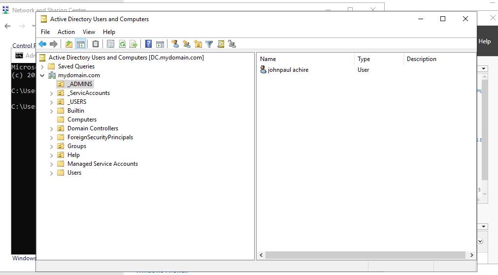
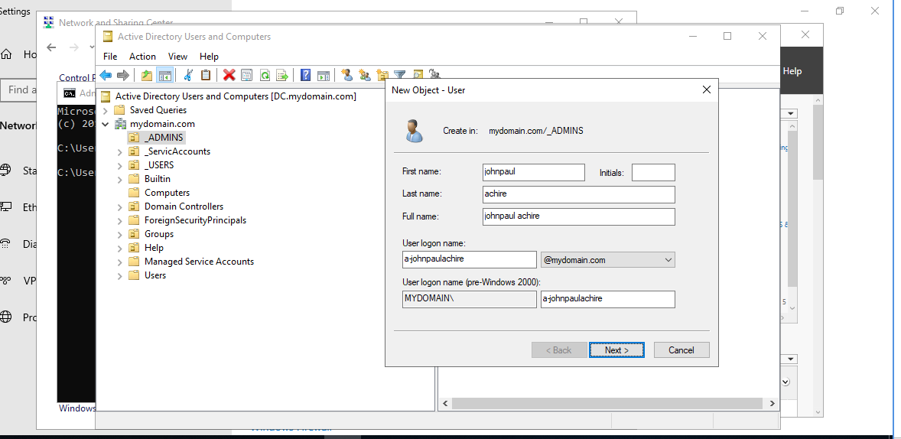
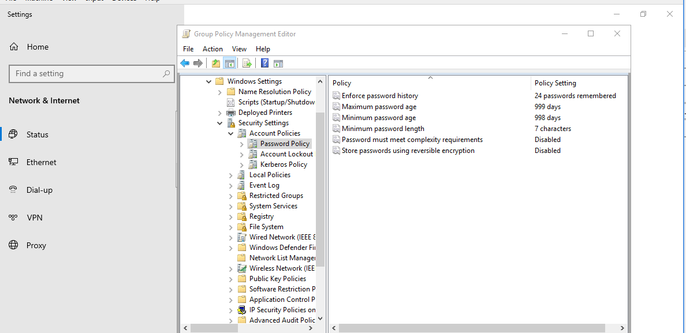
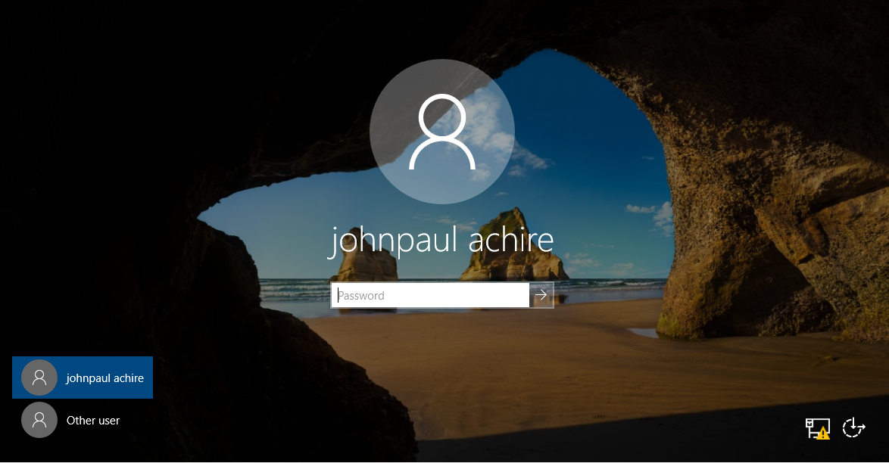

# 🏗 Lab 01 – Core Active Directory Infrastructure Deployment

---

## 📌 Objective

Deploy and configure a fully functional Active Directory Domain Services (AD DS) environment including:

- Static network configuration
- Domain Controller promotion
- Organizational Unit (OU) structure design
- Administrative delegation
- Domain password policy configuration
- Client domain join validation

This lab establishes the foundational identity infrastructure for an enterprise network.

---

## 🖥 Lab Environment

| Component | Configuration |
|------------|--------------|
| Domain Controller | Windows Server 2019 |
| Client Machine | Windows 10 |
| Network Type | Internal Virtual Network |
| DC IP Address | Static Configuration |
| Domain Model | Single Forest, Single Domain |

---

# 🧱 Deployment Process

---

## 1️⃣ Configure Static IP Address (Domain Controller)

A static IP was configured on the Domain Controller to ensure stable DNS and authentication services.

---

## 2️⃣ Install Active Directory Domain Services (AD DS)

Installed the AD DS role via Server Manager.

---

## 3️⃣ Promote Server to Domain Controller

The server was promoted to a new forest and configured as the primary Domain Controller.

- Configured new domain
- Set Directory Services Restore Mode (DSRM) password
- Installed DNS role automatically

---

## 4️⃣ Create Organizational Unit (OU) Structure

Designed structured OUs for logical administrative separation:

- Admin
- IT
- HR
- Users

This structure enables proper delegation and policy application.

---

## 5️⃣ Create Administrative User & Assign to Admin OU

Created a dedicated administrative account and assigned it to the Admin OU.

This supports least-privilege access design and structured administration.

---

## 6️⃣ Configure Domain Password Policy

Modified the Default Domain Policy to enforce:

- Password complexity requirements
- Minimum password length
- Password expiration policy

This strengthens domain authentication security.

---

## 7️⃣ Domain Authentication Test (DC Login)

Performed authentication testing using domain credentials to validate configuration.

---

## 8️⃣ Join Windows 10 Client to Domain

Connected Windows 10 client machine to the domain environment.

- Configured DNS to point to Domain Controller
- Entered domain credentials
- Restarted client system

---

## 9️⃣ Verify Client Added to Active Directory

Confirmed client object appears inside Active Directory Users and Computers.

---

# ✅ Outcome

Successfully deployed a working Active Directory domain environment featuring:

- Structured OU hierarchy
- Administrative segregation
- Security policy enforcement
- Domain-based authentication
- Domain client integration

This lab establishes the core identity infrastructure required for enterprise network management.

---

# 🎯 Skills Demonstrated

- Active Directory deployment
- Domain Controller configuration
- OU design and delegation
- Group Policy management
- Domain authentication troubleshooting
- Client onboarding to enterprise domain

---

# 🔐 Security Considerations

- Enforced password complexity policies
- Structured administrative OU separation
- Validated domain authentication flow
- Centralized identity management

---

# 📁 Folder Structure
│
├── README.md
└── screenshots/
├── 01-static-ip-config.png
├── 02-ad-ds-role-install.png
├── 03-domain-controller-promotion.png
├── 04-ou-structure.png
├── 05-admin-user-created.png
├── 06-password-policy-config.png
├── 07-domain-login-test.png
├── 08-client-domain-join.png
└── 09-client-visible-in-ad.png

